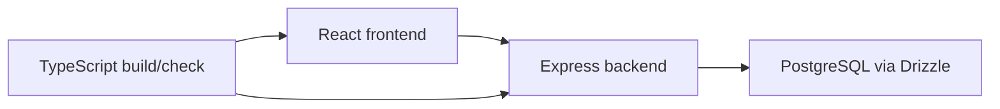

# metalmenders

Full-stack TypeScript sandbox for rapid product prototyping with React, Express, and PostgreSQL.

**Tech spec:** [docs/TECH_SPEC.md](docs/TECH_SPEC.md)

## Problem
Rapid prototyping projects need a structured full-stack baseline for validating product ideas quickly.

## Solution
A full-stack TypeScript sandbox using modern frontend and backend tooling with database migration support.

## Architecture Diagram


## Tech Stack
- TypeScript, Express, React, Drizzle ORM, Vite/tsx tooling

## Setup Instructions
```bash
npm install
npm run dev
```

## Testing
- `npm run check`
- `npm run build`

## Evidence Map
- `server/`
- `client/`
- `package.json`
- Drizzle configuration
- Tech spec: `docs/TECH_SPEC.md`

---

**Maintained by:** [Dark Heart Labs](https://darkheartlabs.technology)  
**Author:** Jennifer ([@jv-darkheartlabs](https://github.com/jv-darkheartlabs))  
**Site:** https://darkheartlabs.technology
