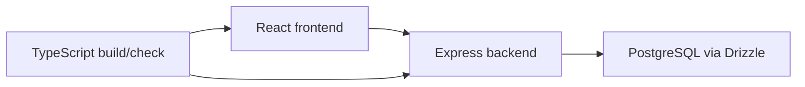

# metalmenders
testing app


## Problem
Rapid prototyping projects need a structured full-stack baseline for validating product ideas quickly.

## Solution
A full-stack TypeScript sandbox using modern frontend and backend tooling with database migration support.

## Architecture Diagram


## Tech Stack
- TypeScript
- Express
- React
- Drizzle ORM
- Vite/tsx tooling

## Setup Instructions
```bash
npm install
npm run dev
```

## Testing
- npm run check
- npm run build

## ANZSCO 261312 Competency Evidence
- Full-stack application prototyping.
- Type-safe backend/frontend integration.
- Database schema and build pipeline management.

## Commit Convention
Use Conventional Commits for presentation clarity:
- `feat(scope): add new user-facing capability`
- `fix(scope): resolve functional defect`
- `test(scope): add or improve automated tests`
- `docs(readme): improve project documentation`

## Evidence Map
- `server/`
- `client/`
- `package.json`
- `drizzle configuration`
